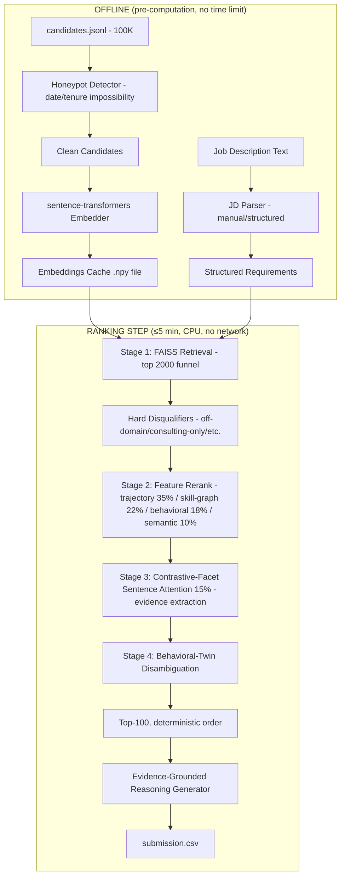

# Redrob Hackathon: AI Candidate-Ranking System

**Team kafka_consumer** | [approach_deck.pdf](approach_deck.pdf) | [APPROACH.md](APPROACH.md) | [Live sandbox](https://huggingface.co/spaces/ojaasgandu/India_Run)

## The Central Thesis
**The LLM should understand. It should never decide.**

Naive LLM-based ranking approaches suffer from severe repetition and permutation instability. They are fundamentally non-deterministic and violate the CPU-only, 5-minute offline runtime constraint of this challenge.

Our approach explicitly separates **Understanding** (offline pre-computation) from **Ranking** (deterministic scoring). The `rank.py` step uses no network, zero LLM calls, and reliably outputs the exact same top-100 ranked candidates on identical inputs within the time limit.

## Architecture



## How to Run

### Quickstart with Docker (recommended for judges)
One command builds the image and runs the full pipeline (precompute → rank → validate):

```bash
# 1. Drop the challenge file at ./input/candidates.jsonl
# 2. Build + run everything:
docker compose up --build
# 3. Result: ./out/submission.csv
```

- The embedding model is **baked into the image at build time**, so the ranking step runs with **no network access** (`TRANSFORMERS_OFFLINE=1`).
- The FAISS index is cached in `./artifacts`, so re-runs skip precompute and only re-run the fast deterministic ranking. `make docker-clean` forces a rebuild.
- The container is capped at 4 CPUs / 16 GB RAM to mirror the judging environment.

### Manual (no Docker)

### 1. Offline Pre-computation
This step computes the sentence-transformer embeddings for all 100,000 candidates and saves the FAISS index to disk. It also scans for and filters out impossible honeypot profiles.
```bash
make precompute
# or
python precompute.py
```

### 2. Deterministic Ranking
This step loads the pre-computed embeddings and deterministically ranks the top 100 candidates via trajectory alignment, skill-graph adjacency, behavioral signals, contrastive sentence attention, and semantic similarity, then disambiguates behavioral twins.
```bash
make rank
# or
python rank.py --candidates ./candidates.jsonl --out ./submission.csv
```

### 3. Validation
Run the provided validator on the resulting CSV.
```bash
make validate
# or
python validate_submission.py submission.csv
```

## The "Keyword Matching is a Trap" Solution
The Job Description explicitly states that finding candidates with the most AI keywords is a trap. We combat this using two key components:
1. **Skill Graph BFS**: Instead of substring matching, skills are normalized to canonical nodes (via an alias map) and we compute the bounded shortest-path distance between a candidate's skills and the JD's requirements on a curated ML/AI domain graph. Verified skills (Redrob assessment score > 70) earn a boost.
2. **Trajectory DP Aligner**: A Needleman-Wunsch global alignment scores the candidate's chronological role sequence against the ideal growth path (SWE → Data → AI/ML), combined with current-title fit, YoE band, production signals, and a title-chaser (short-tenure) penalty. A "Marketing Manager" with AI keywords is hard-disqualified.

Skill graph + trajectory carry the majority of the ranking weight, so keyword-stuffed off-domain profiles cannot rise on semantic similarity alone.

## Distinctive features
- **Contrastive-facet sentence attention** ([docs/attention.md](docs/attention.md)) — query-conditioned attention pooling over sentences, with anti-fit facets that cancel sentence-level keyword stuffing. Surfaces the exact evidence sentence used in each reasoning.
- **Behavioral-twin disambiguation** ([twins/twin_detector.py](twins/twin_detector.py)) — clusters near-duplicate profiles (role + experience + Jaccard skill overlap) and breaks the tie by availability, so paper-identical "twins" don't stack in the top-100.
- **Adversarial robustness test** ([evaluation/adversarial.py](evaluation/adversarial.py)) — injects every JD skill + fake assessments into profiles that shouldn't rank and measures promotion into the top-100. Full system: **0%** for off-domain roles vs **100%** for a naive keyword ranker (see [evaluation/adversarial_report.md](evaluation/adversarial_report.md)).
- **Proven determinism** — `make determinism` ranks twice and confirms byte-identical output.

## Evaluation & Ablation
The JD explicitly requires evaluation rigor (NDCG, MRR, MAP, offline-to-online correlation). We ship an offline harness:
```bash
make evaluate          # or: python -m evaluation.evaluate
```
It compares the full system against two baselines (naive keyword count, pure semantic) and runs a per-component **ablation**, reporting:
- **NDCG@10/@100, MRR, MAP@100** against a transparent recruiter rubric (`evaluation/gold.py`) — weak supervision, with an explicit circularity caveat.
- **Label-free trap metrics** — honeypot % and off-domain-title % in the top-100 (objective, no labels needed).

Key findings (see [evaluation/report.md](evaluation/report.md)):
- The structured pipeline beats naive-keyword and pure-semantic ranking, and cuts off-domain titles in the top-100 from ~27% (semantic-only) to ~4%.
- **Trajectory** is the strongest single fit signal; **semantic** similarity is mainly a *recall* signal (near-inert in final ordering), which informed the production weights.
- Weights in `scoring/hybrid_scorer.py` were tuned from this harness, not guessed.

## Sandbox
**Live:** [huggingface.co/spaces/ojaasgandu/India_Run](https://huggingface.co/spaces/ojaasgandu/India_Run) — upload a small `candidates.jsonl` sample (any subset of the challenge file, up to 1000 rows) and see the full deterministic pipeline run end-to-end — honeypot filtering, skill-graph + trajectory scoring, contrastive sentence attention, and twin disambiguation.

[sandbox_app.py](sandbox_app.py) needs **no precomputed FAISS index** — it embeds the JD on the fly and scores whatever's uploaded directly (`HybridScorer.score_sample`), which also keeps the Space lightweight (no 150MB+ index to bundle).

**Try locally:** `python sandbox_app.py` → opens at `http://localhost:7860`.

**Redeploy / update the Space:**
1. `git clone https://huggingface.co/spaces/ojaasgandu/India_Run` (auth: HF access token as the git password).
2. Copy over the source packages this app imports (see [sandbox_app.py](sandbox_app.py)'s imports) + `jd_requirements.json` + `requirements.txt`, and [SPACE_README.md](SPACE_README.md) as the Space's `README.md`.
3. `git add -A && git commit && git push` — the Space rebuilds automatically.

## Portal Deliverables
- [approach_deck.pdf](approach_deck.pdf) — 20-slide write-up (problem, thesis, architecture, trap defenses, both novel components, evaluation methodology + results tables, sample output, limitations, tech stack).
- [submission.xlsx](submission.xlsx) — the top-100 ranking in spreadsheet form.
- Both are generated from `submission.csv` by [scripts/make_deliverables.py](scripts/make_deliverables.py); regenerate after any re-ranking with `python scripts/make_deliverables.py`.
- [submission_metadata.yaml](submission_metadata.yaml) — team/contact info, AI-tool declaration, and methodology summary for the portal.

## Determinism & Adversarial Robustness
```bash
make determinism    # ranks twice, diffs the output -- confirms byte-identical results
make adversarial    # python -m evaluation.adversarial -- keyword-stuffing attack, see evaluation/adversarial_report.md
```
